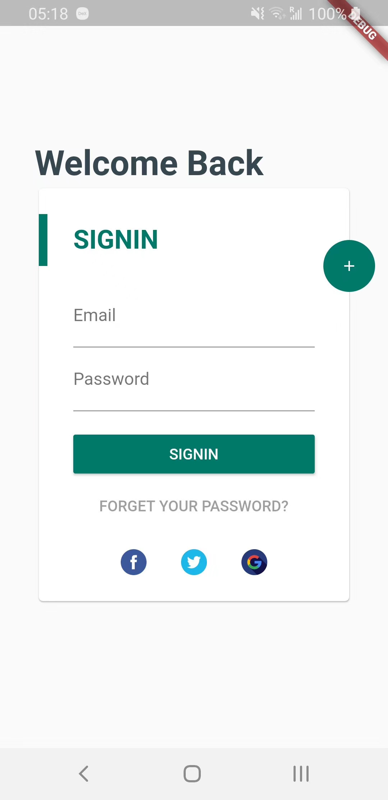
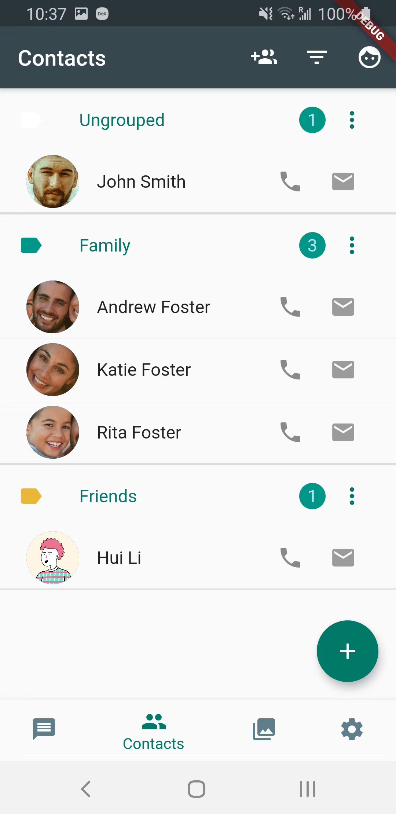

# RoloBox
RoloBox is my capstone project during my study in [UWL](https://www.uwlax.edu/), it has been moved offline after I completed my project presentation.

- [rolobox-angular](https://github.com/greenlihui/rolobox-angular)
- [rolobox-node](https://github.com/greenlihui/rolobox-node)
- [rolobox-flutter](https://github.com/greenlihui/rolobox-flutter)

This repository is the mobile application of RoloBox, written with Flutter. The real time face detection is implemented with google firebase ml kit.

See more details about rolobox in [rolobox-node](https://github.com/greenlihui/rolobox-node)

## screenshots
- login

- contacts
